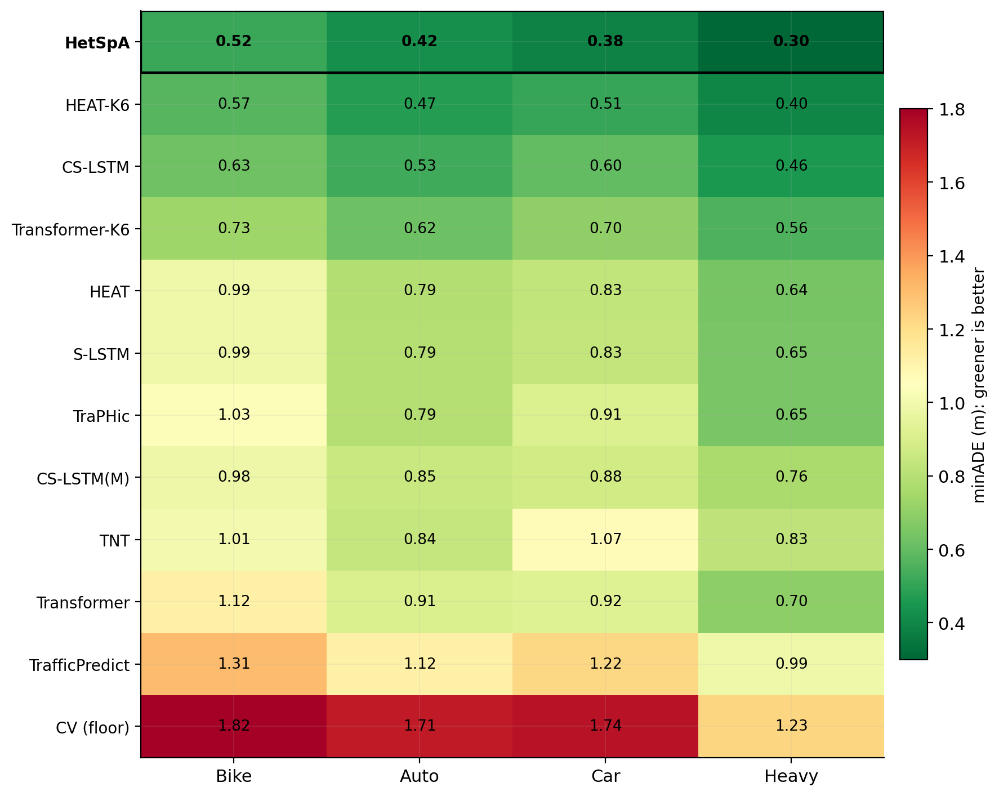
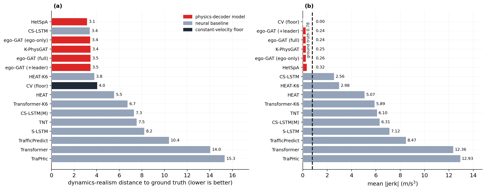
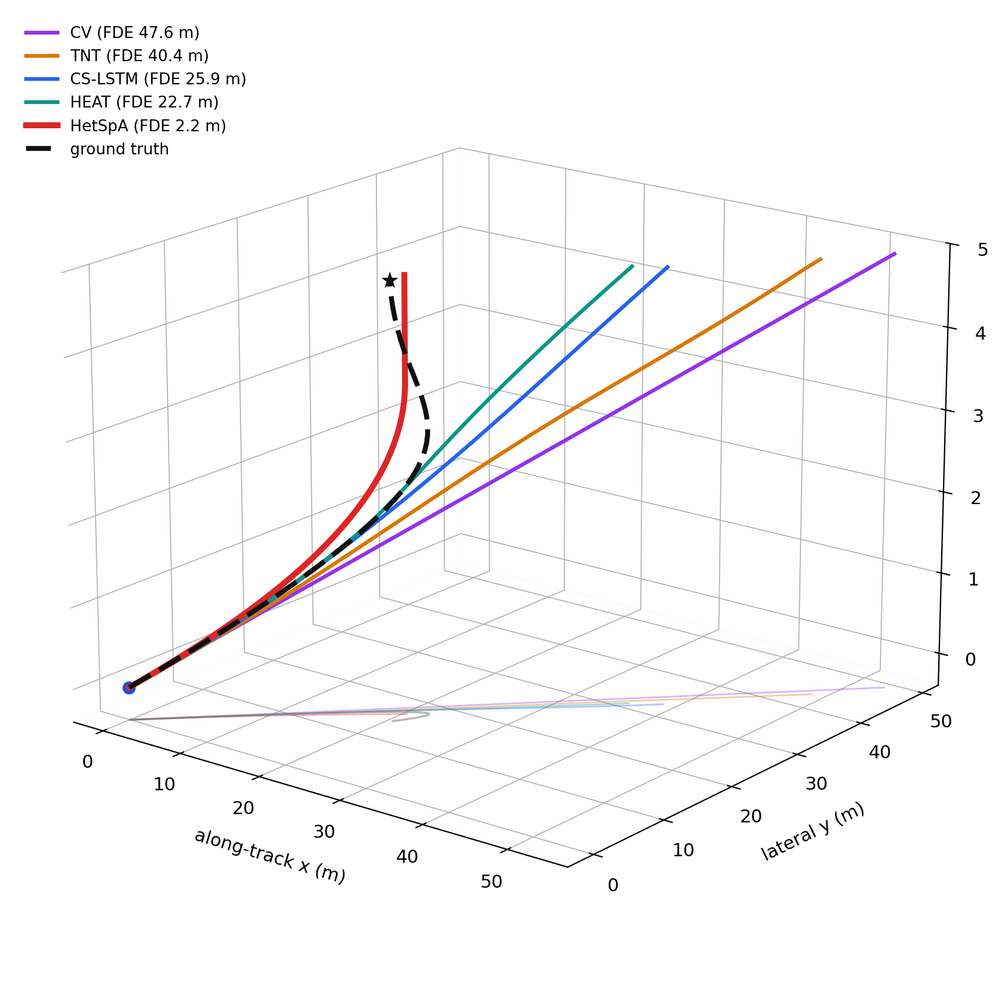
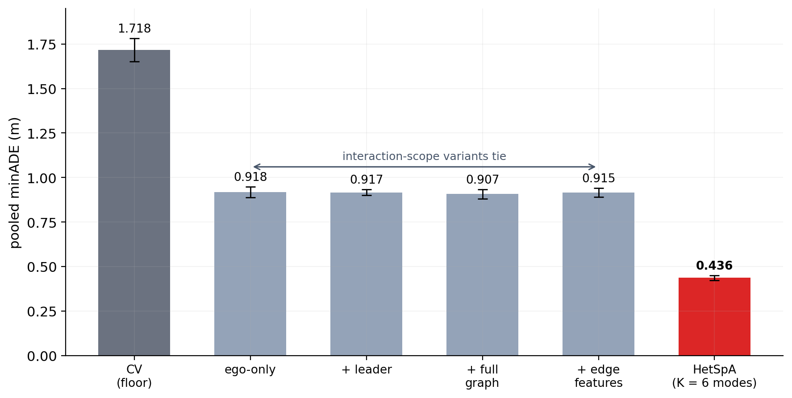
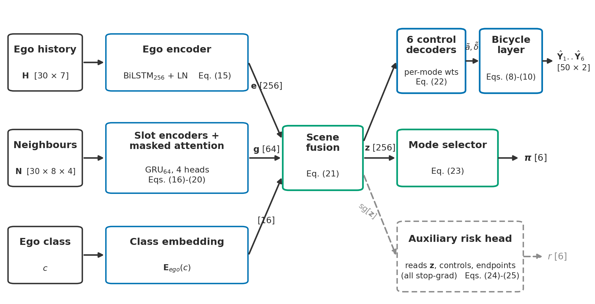

<div align="center">

# Trajectory Prediction for Heterogeneous Indian Urban Traffic

### **HetSpA** — Heterogeneous Spatial Attention, bicycle-decoded and multimodal

*Given 3 seconds of observed motion, predict the next 5 seconds — for bikes, autos, cars, and heavy vehicles sharing lane-free Indian roads, with every prediction physically drivable by construction.*

[](https://www.python.org/)
[](https://www.tensorflow.org/)
[](LICENSE)
[](https://www.iitg.ac.in/)
[]()

**M.Tech Thesis · IIT Guwahati · Department of Civil Engineering · 2024 – Present**
Supervisor: **Prof. C. Mallikarjuna** · Transportation Systems Engineering

*Manuscript in preparation for Transportation Research Part C.*

[Results](#-headline-results) · [Realism](#-does-it-drive-like-the-real-thing) · [Turns](#-the-turn-that-single-mode-models-miss) · [What carries the signal](#-what-actually-carries-the-signal) · [Architecture](#-architecture) · [Reproduce](#%EF%B8%8F-reproducibility) · [Lessons](#-engineering-lessons-from-the-trenches) · [Roadmap](#%EF%B8%8F-roadmap)

</div>

---

## 🎯 The problem

Almost every published trajectory-prediction model is trained and evaluated on **NGSIM** — a structured US freeway dataset with strict lanes, two vehicle classes, and orderly car-following behaviour. Deploy those models on an Indian urban arterial and they meet a different world: lane discipline is absent, vehicle classes span a wide mass range (a 200 kg motorbike weaving past a heavy bus), and interactions are *overtaking and weaving* rather than *following*.

This project asks one question:

> **Can an interaction-aware, physics-decoded, multimodal model predict motion on lane-free heterogeneous traffic — without ever emitting a physically impossible trajectory — and can we honestly say *what* in the scene makes the prediction work?**

It is answered in two parts. First, a **protocol-honesty study on NGSIM**: the same model is scored under the field's customary split and under a leakage-free split, to measure how much the customary protocol flatters everyone. Second, the **HetSpA model on real Indian drone-video data (Warangal)**, followed by a diagnostic that asks which parts of the scene actually carry the predictive signal.

<div align="center">

| Property | NGSIM (US freeway) | Warangal (India urban) |
|---|---|---|
| Road type | Structured freeway | Undivided urban arterial |
| Lane discipline | Strict | Effectively absent |
| Vehicle classes | Cars, trucks | Bikes, autos, cars, heavy |
| Interaction style | Following, merging | Weaving, overtaking, lateral drift |
| Capture | Camera, roadside | Drone video, top-down |

</div>

---

## 🏆 Headline results

### Warangal heterogeneous urban — HetSpA vs eight in-harness baselines

<div align="center">

</div>

The dataset is a lane-free Indian urban arterial captured by drone at 30 Hz and downsampled to 10 Hz. Each window is **3 s of history (30 steps) + 5 s of future (50 steps)**. There are **12,762 unique vehicles** — Bike 7,355 (57.6%), Auto 2,734, Car 2,132 (16.7%), Heavy 541 — and **147,847 training windows** after per-class capping (Bike and Auto capped at 50,000 each, Car 37,281, Heavy 10,566). Evaluation uses a **3-fold vehicle-ID GroupKFold**: no vehicle ever appears in both the train and the test side of a fold. All numbers below are pooled over the **44,088 stored test windows**, reported as **3-fold mean ± sd**.

HetSpA is compared against **eight baselines re-implemented in one training harness** — Constant Velocity, S-LSTM, CS-LSTM, TraPHic, TrafficPredict, TNT, Transformer, and HEAT — plus K = 6 multimodal variants of Transformer, HEAT, and CS-LSTM(M), so every model sees the same data, the same split, and the same preprocessing. This is an in-harness comparison, not a comparison to published leaderboard numbers.

<div align="center">

| Metric | HetSpA | Strongest baseline | Margin |
|---|---:|---|---:|
| **Pooled minADE (best-of-6)** | **0.436 ± 0.014 m** | HEAT-K6 0.510 ± 0.072 | ~15% |
| | | CS-LSTM 0.572 ± 0.021 | ~24% |
| **Pooled minFDE** | **1.09 m** | *(best in every class)* | — |

</div>

**Per-class minADE (m):** Bike 0.517 · Auto 0.425 · Car 0.383 · Heavy 0.304 — HetSpA leads the harness in every class.

Window-by-window over all 44,088 test windows, HetSpA is the better model on **65.1%** of windows versus HEAT-K6 (mean gap 0.074 m) and **72.8%** versus CS-LSTM (mean gap 0.136 m). The lead is broad, not carried by a handful of easy scenes.

> **One honest caveat on the metric.** minADE is a *best-of-six* score: it credits the closest of the six predicted modes. If you must commit to a single mode at deploy time, the picture changes — see below.

#### The metric we lose, reported plainly

A multimodal model that keeps six hypotheses pays for it when forced to pick one. On **deployed top-1 ADE** (single committed mode, no oracle), the single-mode baselines win: **HEAT 0.855, S-LSTM 0.858, HetSpA 0.950**. That gap is a structural cost of carrying six modes, not a bug. A **trained commitment head** that scores and selects one mode closes it to **0.874** while keeping all six modes available for a downstream planner. We report both numbers because hiding the top-1 gap would be the dishonest thing to do.

Per-class summary: [`results/warangal/best_per_class.csv`](results/warangal/best_per_class.csv) · Dataset stats: [`results/warangal/dataset_stats.csv`](results/warangal/dataset_stats.csv) · Methodology: [`docs/SP_GAT_warangal.md`](docs/SP_GAT_warangal.md).

---

### NGSIM US-101 — a protocol-honesty study, not a SOTA contest

NGSIM here is used for one purpose: to measure how much the **evaluation split** flatters a model on a homogeneous benchmark. The NGSIM-side model is **K-PhysGAT** (the earlier physics-decoded GAT that is HetSpA's ancestor). The same model, the same data, only the split changes:

<div align="center">

| Protocol | ADE (1→5 s) | Note |
|---|---:|---|
| Random 80/10/10 split *(the field's customary protocol)* | **0.863 m** | vehicles can appear in both train and test |
| Vehicle-ID GroupKFold, 15 runs *(leakage-free)* | **1.053 ± 0.013 m** | no vehicle overlap across folds |
| K = 6 multimodal, minADE, GroupKFold | **0.704 ± 0.031 m** | best-of-6 |

</div>

Going from the customary split to a leakage-free one **inflates the error by ~18%** — from vehicle-identity leakage alone, with nothing else changed. That is the finding: the customary protocol flatters every model, and published numbers rest on it.

> **⚠️ Mandatory caveat — read before comparing any NGSIM number here to the literature.**
> Our NGSIM pipeline uses **pre-smoothed 10 Hz data** and a **different split** from the published literature, so these numbers are **not line-comparable** to published results, and **no ranking against them is claimed**. The point of this study is the *within-model* effect of the split, not a leaderboard position.

For orientation, the table below places our numbers beside representative published NGSIM results. Most papers report the same metric family (ADE over a 5 s horizon on US-101), which is what makes the side-by-side worth showing at all — but the caveat above applies to every row: protocols differ across papers (sampling rate, smoothing, split), our own constant-velocity reference row does not reproduce published CV figures for exactly that reason, and no ranking is claimed.

<div align="center">

| Model | Year | @1s | @3s | @5s | **ADE 1→5s** |
|---|---:|---:|---:|---:|---:|
| Constant Velocity *(our pipeline's reference)* | — | 0.498 | 2.572 | 6.303 | 2.985 |
| CS-LSTM *(de facto baseline)* | 2018 | 0.61 | 2.14 | 4.30 | 1.95 |
| GRIP++ | 2019 | 0.38 | 1.62 | 3.48 | 1.61 |
| GISNet | 2020 | 0.33 | 1.48 | 2.95 | 1.40 |
| HierarchicalGNN | 2021 | 0.34 | 1.32 | 2.83 | 1.30 |
| CDSTraj | 2024 | 0.36 | 1.36 | 2.85 | 1.49 |
| BAT | 2024 | 0.23 | 1.54 | 3.62 | 1.74 |
| VT-Former | 2024 | — | — | — | 0.82 |
| **K-PhysGAT — random split** *(ours)* | 2026 | 0.269 | 0.594 | 1.986 | 0.863 |
| **K-PhysGAT — GroupKFold, 15 runs** *(ours)* | 2026 | 0.332 | 0.642 | 2.546 | 1.053 ± 0.013 |
| **K-PhysGAT — K=6 multimodal, minADE** *(ours)* | 2026 | — | — | 1.446 | 0.704 ± 0.031 |

*Representative published results shown for context only; protocols differ per the caveat above, so the table is an orientation, not a leaderboard. Published rows as curated in [`results/ngsim_v14/sota_comparison.csv`](results/ngsim_v14/sota_comparison.csv).*

</div>

NGSIM protocol-study outputs: [`results/ngsim_v14/`](results/ngsim_v14/) · Methodology: [`docs/K_PhysGAT_NGSIM.md`](docs/K_PhysGAT_NGSIM.md).

---

## 🚗 Does it drive like the real thing?

<div align="center">

</div>

Low ADE does not guarantee a *plausible* trajectory — a model can be geometrically close while turning and jerking in ways no real vehicle would. Because HetSpA decodes through a kinematic bicycle model, its outputs stay inside what a vehicle can physically do, and it shows:

- **HetSpA is the only model that reproduces the real Bike > Auto > Car > Heavy ordering** of heading rate and jerk — lighter classes genuinely manoeuvre more sharply, and the model preserves that structure across classes.
- **Mean jerk 0.32 m/s³**, against a ground-truth **0.78** and baselines from **2.6 to 12.9** — the baselines are an order of magnitude too rough, producing motion that reads as physically implausible.
- On an aggregate realism distance, HetSpA scores **3.15 vs the best baseline's 3.39** — a modest margin, stated as modest.

---

## ↩️ The turn that single-mode models miss

<div align="center">

</div>

Turns are where multimodality earns its keep. On a **safety-critical left turn**, HetSpA commits to the bending mode and finishes **2.2 m** from the true endpoint, while single-mode baselines run straight through the corner and end **23–48 m** away — the difference between a usable prediction and a dangerous one.

> **The honest caveat.** On the **full 45-window turning subset**, all models are **statistically tied**. The turn above is a striking, real, illustrative case, but it is not evidence of statistical dominance on turns in general — and we do not claim it is.

---

## 🔬 What actually carries the signal

<div align="center">

</div>

The second half of the work is a diagnostic: *what in the scene makes the prediction work?* Holding vehicle class and kinematics fixed and removing **all neighbour information** costs only **centimetres** at this largely free-flow site. The interaction channel is not dead — it demonstrably **fires** (on off-site data the full graph beats the ego-only model on **70.5%** of windows) — but its **payload is small** here. What carries the predictive signal is **vehicle-class and kinematic structure**, not fine-grained neighbour interaction, at least at a free-flow arterial.

This is an unglamorous result, and it is the honest one. To check it does not depend on our site or our code, we replicate the attribution on **SinD** (public drone data over four-city Chinese intersections): the same decomposition holds. As an external cross-check, the published **HEAT** model trained on the same SinD cache lands at **HEAT-K6 0.316 vs HetSpA 0.334** — a **statistical near-tie**, disclosed rather than buried. A different architecture, trained independently, reaches the same neighbourhood.

---

## 🧠 Architecture

<div align="center">

</div>

**HetSpA** (Heterogeneous Spatial Attention) is built from six parts:

1. **Ego GRU encoder** — encodes the target vehicle's 3 s of history into a motion state.
2. **8-slot neighbour encoder with masked social attention** — up to eight neighbours are attended over, with masking so empty slots contribute nothing.
3. **Class-conditioned scene state** — the fused representation is conditioned on vehicle class, so a bike and a heavy vehicle are decoded differently.
4. **Kinematic bicycle decoder** — the network outputs *bounded controls*, integrated through the bicycle equations. **Every predicted trajectory is physically drivable by construction** — no teleporting, no instantaneous reversals, no NaN blow-ups. This is what makes the outputs safe for a planner to consume.
5. **Six modes with a scoring head** — the model predicts six candidate futures and scores them, so a downstream consumer can reason over alternatives (and the commitment head can pick one when required).
6. **ACT (Anticipated Collision Time) risk instrument** — a safety-oriented readout over the predicted modes.

**~1.87 M parameters.** Trained with a label-preserving **Y-flip augmentation** on the symmetric road. The flip is disclosed and was **ablated**: a no-flip run scores **0.4205 ± 0.0189 m** against the augmented **0.436 ± 0.014 m** — within noise, so the augmentation is **not load-bearing**. The reported model keeps it because the model was specified before the ablation, not because the ablation proved it necessary.

Full architecture and training detail: [`docs/SP_GAT_warangal.md`](docs/SP_GAT_warangal.md).

---

## 💡 Engineering lessons from the trenches

A research project is judged as much by the bugs it found and the claims it refused to make as by the numbers it reports. These are process lessons, earned from training logs and evaluation scripts, not from papers.

**1 · Trust the protocol before the number — including your own.** The single biggest lesson of the project. The NGSIM study exists to make it concrete: a leakage-free split inflated the same model's error by ~18% with nothing else changed. Sub-metre errors on a hard task are a reason to audit the split first, not to celebrate. *A number is not comparable to a published number until preprocessing, sampling rate, split, and horizon all match — and often it is not comparable at all.*

**2 · The composite-ID bug was the single biggest source of error.** Numeric-only vehicle IDs collided across classes — `Bike` id 1 and `Car` id 1 overwrote each other in the neighbour dictionary, silently corrupting cross-class training data. Errors of tens of metres were not the model's fault. Composite string IDs (`"Bike_1"`, `"Car_1"`) fixed it. *When the model "doesn't work", suspect the data pipeline before the architecture.*

**3 · `val_loss = 0` is a silent killer.** Keras' compiled-loss reduction returned `0.0` for validation when the loss had auxiliary terms, so early stopping ran on a meaningless signal and the model overfit invisibly. Fixed by overriding `test_step`. *Verify `val_loss > 0` before trusting any training curve.*

**4 · Sample count is not sample independence.** Dropping the window stride to get more windows produces highly correlated, overlapping samples. A larger stride generalised better despite fewer samples. *Independence matters more than count.*

**5 · A shared scaler stopped the NaNs.** A separate scaler for neighbour features divided by near-zero when relative positions clustered around the origin, spawning NaNs that killed training mid-epoch. Reusing the ego scaler for neighbours fixed it. *Watch for near-zero denominators in any relative-coordinate normalisation.*

**6 · Report the spread, not the best run.** Every headline here is a 3-fold (Warangal) or 15-run (NGSIM) mean ± sd, not a lucky single run. Best-of-N reporting hides seed luck and is the first thing a sharp reviewer attacks. *Mean and std beats best-of-N every time.*

**7 · Ablate before you attribute.** The Y-flip augmentation *looked* load-bearing; the ablation showed it lands within noise, so the README says so. The interaction channel *should* matter; the diagnostic showed its payload is centimetres at this site, so the README says that too. *An improvement earns its story only if a pre-registered check confirms it — and a null result is a success of the process, not a failure.*

**8 · Report the metric you lose.** HetSpA loses on deployed top-1 ADE and we print the number. *Hiding the weakness a reviewer will find anyway costs more credibility than the weakness itself.*

---

## 📂 Repository structure

```
trajectory-prediction-indian-traffic/
│
├── README.md                                  ← you are here
├── LICENSE                                    ← MIT
├── requirements.txt                           ← TF 2.15, NumPy, etc
│
├── notebooks/
│   ├── 01_ngsim_kphysgat_v14.ipynb            ← NGSIM protocol study (K-PhysGAT)
│   └── 02_warangal_spgat_phases.ipynb         ← Warangal model development
│
├── results/
│   ├── ngsim_v14/                             ← NGSIM protocol-study outputs (see caveat)
│   │   ├── ade_per_second_random_split.csv
│   │   ├── multimodal_K6_groupkfold.csv
│   │   ├── inference_latency.csv
│   │   ├── all_results_random_and_groupkfold.json
│   │   └── summary_15run_variance.json        ← 15-run mean / std / per-fold
│   └── warangal/
│       ├── best_per_class.csv                 ← HetSpA per-class minADE / minFDE
│       └── dataset_stats.csv                  ← vehicle and window counts
│
├── docs/
│   ├── SP_GAT_warangal.md                     ← HetSpA methodology + diagnostic
│   ├── K_PhysGAT_NGSIM.md                     ← NGSIM protocol-study methodology
│   └── assets/                                ← README figures (ARCH / T1 / REAL2 / V1 / E1)
│
└── papers/
    └── REFERENCES.md                          ← influential papers + BibTeX
```

---

## ⚙️ Reproducibility

```bash
git clone https://github.com/satyamk4517/trajectory-prediction-indian-traffic.git
cd trajectory-prediction-indian-traffic
pip install -r requirements.txt
```

| Notebook | What it does |
|---|---|
| [`01_ngsim_kphysgat_v14.ipynb`](notebooks/01_ngsim_kphysgat_v14.ipynb) | Builds the NGSIM cache and runs the protocol study — the same model scored under the random split and under the 15-run vehicle-ID GroupKFold, plus the K = 6 multimodal eval. |
| [`02_warangal_spgat_phases.ipynb`](notebooks/02_warangal_spgat_phases.ipynb) | The Warangal model-development journey behind HetSpA — including the failed steps that taught the most. |

### Datasets

| Dataset | Source | Access |
|---|---|---|
| **NGSIM US-101** | US Federal Highway Administration | Public — [download](https://ops.fhwa.dot.gov/trafficanalysistools/ngsim.htm) |
| **SinD** | Public drone dataset (four-city intersections) | Public — used for the external replication check |
| **Warangal urban drone** | IIT Guwahati / Prof. Mallikarjuna's lab | Not publicly released — contact the supervisor for academic access |

### Evaluation protocol

| Setting | NGSIM (K-PhysGAT) | Warangal (HetSpA) |
|---|---|---|
| Observation horizon | 30 frames (3 s @ 10 Hz) | 30 frames (3 s @ 10 Hz) |
| Prediction horizon | 50 frames (5 s) | 50 frames (5 s) |
| Split | Random 80/10/10 **and** vehicle-ID GroupKFold | **3-fold vehicle-ID GroupKFold** |
| Reporting | 15-run mean ± sd | 3-fold mean ± sd, pooled over 44,088 windows |

---

## 🗺️ Roadmap

- [x] **NGSIM protocol study** — same model under random split vs 15-run vehicle-ID GroupKFold; ~18% split-driven inflation quantified.
- [x] **HetSpA on Warangal** — heterogeneous spatial attention, bicycle decoder, six modes, ACT risk head; 3-fold GroupKFold headline minADE 0.436 ± 0.014 m.
- [x] **Diagnostic** — interaction-ablation ladder showing class + kinematics carry the signal at this free-flow site.
- [x] **External replication** — attribution reproduced on SinD; HEAT trained on the same cache corroborates it (near-tie, disclosed).
- [x] **Flip-augmentation ablation** — confirmed not load-bearing (within noise).
- [x] **Commitment head** — closes the deployed top-1 gap to 0.874 while keeping all six modes.
- [ ] **Manuscript** — in preparation for Transportation Research Part C.
- [ ] **Intersection-level prediction** — where the interaction channel is expected to carry more (the SinD signal fires there).
- [ ] **Lane-graph / HD-map conditioning** — for structured-scene extensions.
- [ ] **Latency hardening** — real-time single-sample decode path for deployment.

---

## 👤 About

<table>
<tr>
<td valign="top">

**Satyam Kumar**
M.Tech · Transportation Systems Engineering
Indian Institute of Technology Guwahati

Supervisor: **Prof. C. Mallikarjuna**
Department of Civil Engineering, IIT Guwahati

I work where traffic engineering meets deep learning — physics-decoded, safety-aware models for heterogeneous traffic, the kind that exists outside NGSIM. I care about evaluation honesty, reproducibility, and the unglamorous bugs and null results that decide whether a model actually works.

</td>
<td valign="top" width="320">

**📫 Get in touch**

✉️  [satyamk4517@iitg.ac.in](mailto:satyamk4517@iitg.ac.in)
✉️  [satyamshivam511@gmail.com](mailto:satyamshivam511@gmail.com)
💼  [LinkedIn](https://www.linkedin.com/in/satyam-kumar-4517-iitg)
🏛️  [IIT Guwahati — Civil](https://www.iitg.ac.in/civil/)

*If you are hiring, collaborating, or working on motion forecasting for non-Western traffic — I'd love to talk.*

</td>
</tr>
</table>

---

## 📄 Citation

*M.Tech thesis and a manuscript in preparation for Transportation Research Part C (2026). If this work is useful to you:*

```bibtex
@mastersthesis{kumar2026hetspa,
  author  = {Kumar, Satyam},
  title   = {Vehicle Trajectory Prediction using AI/ML Models for Urban Roads
             and Intersections in Heterogeneous Traffic},
  school  = {Indian Institute of Technology Guwahati},
  year    = {2026},
  type    = {M.Tech Thesis (in preparation)},
  address = {Guwahati, India},
  note    = {Department of Civil Engineering, Transportation Systems Engineering.
             Supervisor: Prof. C. Mallikarjuna.}
}
```

---

<div align="center">

**Keywords** · trajectory prediction · heterogeneous spatial attention · graph attention · physics-decoded deep learning · kinematic bicycle model · multimodal forecasting · heterogeneous traffic · Indian urban traffic · evaluation honesty · NGSIM · Warangal · SinD · motion forecasting · autonomous vehicles · ITS

</div>
