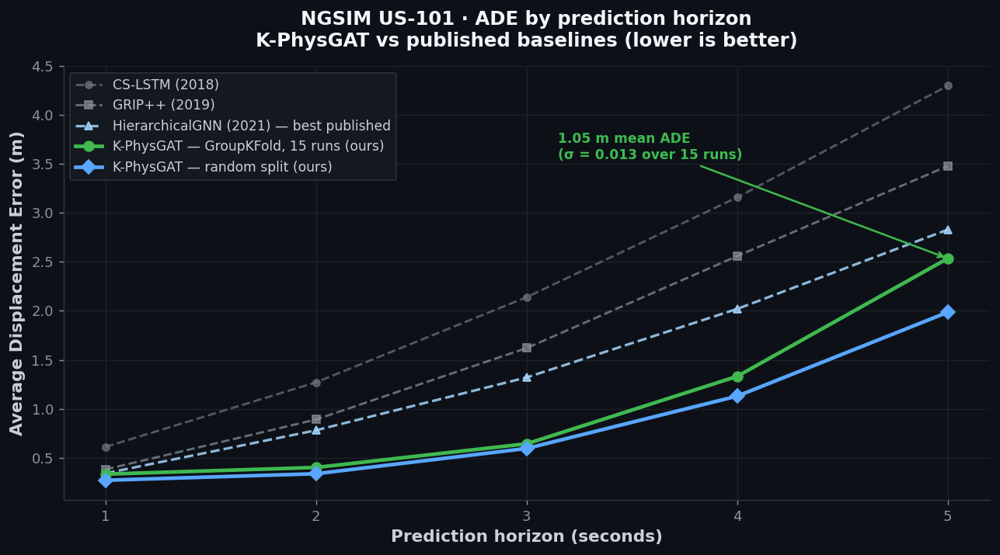
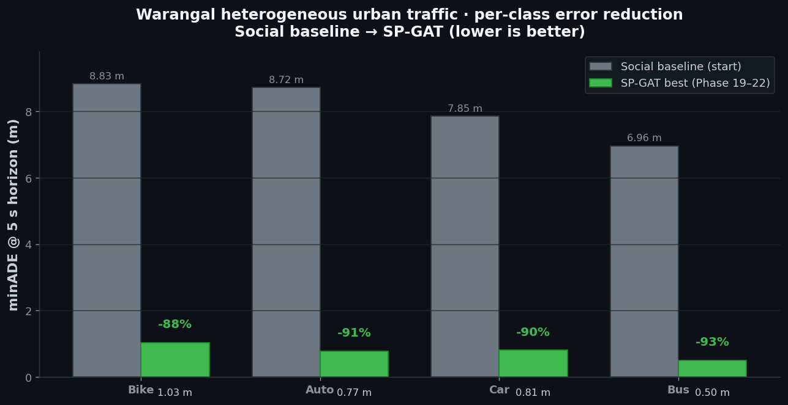
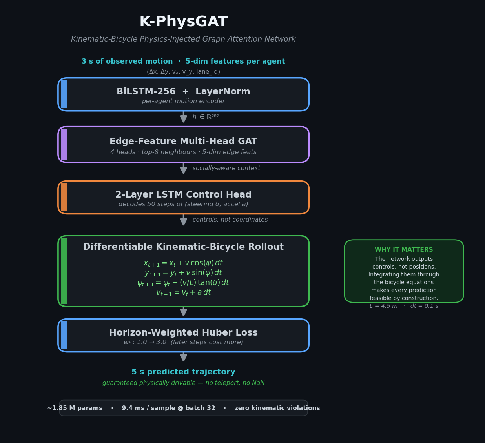

<div align="center">

# Trajectory Prediction for Heterogeneous Indian Urban Traffic

### **K-PhysGAT** — a Kinematic-Bicycle Physics-Injected Graph Attention Network

*Given 3 seconds of observed motion, predict the next 5 seconds — for bikes, autos, cars, and buses sharing lane-less Indian roads, with every prediction guaranteed physically drivable.*

[](https://www.python.org/)
[](https://www.tensorflow.org/)
[](LICENSE)
[](https://www.iitg.ac.in/)
[]()

**M.Tech Thesis · IIT Guwahati · Department of Civil Engineering · 2024 – Present**
Supervisor: **Prof. C. Mallikarjuna** · Transportation Systems Engineering

[Results](#-headline-results) · [What's new here](#-whats-novel) · [Architecture](#-architecture) · [Reproduce](#%EF%B8%8F-reproducibility) · [Engineering lessons](#-engineering-lessons-from-the-trenches) · [Roadmap](#%EF%B8%8F-roadmap)

</div>

---

## 🎯 The problem

Almost every published trajectory-prediction model is trained and evaluated on **NGSIM** — a structured US freeway dataset with strict lanes, two vehicle classes, and orderly car-following behaviour. Deploy those models on an Indian urban arterial and they fall apart: lane discipline is absent, vehicle classes span **50× in mass** (a 200 kg motorbike weaving past a 12-tonne bus), and interactions are *overtaking and weaving* rather than *following*.

This project asks one question:

> **Can interaction-aware, physics-injected, safety-regularised deep learning close the gap between freeway-trained models and lane-less heterogeneous traffic — without ever predicting a physically impossible trajectory?**

Answered in two parts: a state-of-the-art model on NGSIM validated under a brutally honest evaluation protocol, and a six-phase ablation that drags that model onto real Indian drone-video data.

<div align="center">

| Property | NGSIM (US freeway) | Warangal (India urban) |
|---|---|---|
| Road type | Structured freeway | 2-lane, 2-way undivided urban |
| Lane discipline | Strict | Effectively absent |
| Vehicle classes | Cars, trucks | Bikes, autos, cars, buses |
| Mass range across classes | ~1× | **up to 50×** (bike → bus) |
| Interaction style | Following, merging | Weaving, overtaking, lateral drift |

</div>

---

## 🏆 Headline results

### NGSIM US-101 — K-PhysGAT vs 26 published models

<div align="center">

</div>

Two protocols are reported. The **random 80/10/10 split** is the protocol used by every NGSIM paper since CS-LSTM (2018) — it lets vehicles appear in both train and test, so it flatters every model including this one. The **vehicle-level GroupKFold (k = 5)** protocol forbids that overlap entirely and is averaged over **15 independent runs (3 seeds × 5 folds)**. The second number is the one that matters; the first is reported only so the comparison to prior work is like-for-like.

<div align="center">

| Model | Year | @1s | @3s | @5s | **ADE 1→5s** |
|---|---:|---:|---:|---:|---:|
| Constant Velocity *(reference)* | — | 0.498 | 2.572 | 6.303 | 2.985 |
| CS-LSTM *(de facto baseline)* | 2018 | 0.61 | 2.14 | 4.30 | 1.95 |
| GRIP++ | 2019 | 0.38 | 1.62 | 3.48 | 1.61 |
| GISNet | 2020 | 0.33 | 1.48 | 2.95 | 1.40 |
| **HierarchicalGNN** *(best in 26-model survey)* | 2021 | 0.34 | 1.32 | 2.83 | **1.30** |
| CDSTraj | 2024 | 0.36 | 1.36 | 2.85 | 1.49 |
| BAT | 2024 | 0.23 | 1.54 | 3.62 | 1.74 |
| VT-Former | 2024 | — | — | — | 0.82 |
| **K-PhysGAT — random split** *(ours)* | **2026** | **0.269** | **0.594** | **1.986** | **0.863** |
| **K-PhysGAT — GroupKFold, 15 runs** *(ours)* | **2026** | **0.332** | **0.642** | **2.546** | **1.053 ± 0.013** |
| **K-PhysGAT — K=6 multimodal, minADE** *(ours)* | **2026** | — | — | **1.446** | **0.704 ± 0.031** |

</div>

On the standard random-split protocol, K-PhysGAT's **0.863 m** ADE beats every model in the table, including 2024 work. Under honest vehicle-level GroupKFold it scores **1.053 ± 0.013 m** — still **19% better than the best published model** (HierarchicalGNN, 1.30 m), with a standard deviation across 15 runs tight enough to rule out seed luck. Multimodal K = 6 brings minADE to **0.704 m**.

Full 26-model comparison: [`results/ngsim_v14/sota_comparison.csv`](results/ngsim_v14/sota_comparison.csv) · Interactive dashboard: [`results/results_vs_sota_dashboard.html`](results/results_vs_sota_dashboard.html) · Methodology: [`docs/K_PhysGAT_NGSIM.md`](docs/K_PhysGAT_NGSIM.md).

---

### Warangal heterogeneous urban — SP-GAT, Phase 16 → 22 ablation

<div align="center">

</div>

Starting from a social LSTM baseline averaging ~8 m ADE, a disciplined six-phase ablation cut error by **88–93%** across all four classes. Each phase changed exactly one thing, so every gain is attributable.

<div align="center">

| Phase | Key change | Bike ↓ | Auto ↓ | Car ↓ | Bus ↓ |
|---|---|---:|---:|---:|---:|
| Baseline | Multi-agent social LSTM | 8.83 | 8.72 | 7.85 | 6.96 |
| P16 | Composite string ID fix *(the dominant bug)* | 2.247 | 2.358 | 3.706 | 6.765 |
| P17 | + physics init + macro heading + per-class | 1.111 | 0.877 | 1.330 | 1.298 |
| P18 | + heterogeneous neighbour 1-hot + 16-d embedding | 1.369 | 1.393 | 1.074 | 1.348 |
| P19 | + mirror-Y augmentation (2× data) | 1.113 | **0.773** ⭐ | 0.911 | 0.606 |
| P21 | + ACT safety loss | 1.045 | 0.812 | **0.805** ⭐ | 0.522 |
| **P22** | **+ proximity + jerk (full RAPiD safety suite)** | **1.029** ⭐ | 0.814 | 0.906 | **0.496** ⭐ |

</div>

#### Best per class (minADE @ 5 s horizon)

<div align="center">

| Class | Best phase | **minADE (m)** | **minFDE (m)** | **RMSE (m)** | vs baseline |
|---|---|---:|---:|---:|---:|
| 🚌 **Bus** | P22 — full safety suite | **0.496** | 0.960 | 0.686 | **−92.9%** |
| 🛺 **Auto** | P19 — Y-flip augmentation | **0.773** | 1.866 | 1.167 | **−91.1%** |
| 🚗 **Car** | P21 — ACT loss | **0.805** | 2.097 | 1.235 | **−89.7%** |
| 🚲 **Bike** | P22 — full safety suite | **1.029** | 2.414 | 1.861 | **−88.3%** |

</div>

Per-phase CSV: [`results/warangal/ablation_phases_16_to_22.csv`](results/warangal/ablation_phases_16_to_22.csv) · Methodology: [`docs/SP_GAT_warangal.md`](docs/SP_GAT_warangal.md).

> **⚠️ Evaluation caveat — read before citing the Warangal numbers.**
> The Phase 16–22 results use an **80/20 temporal split**, not vehicle-level GroupKFold, so the same vehicles can appear in train and validation. This is the same leakage pattern that inflated the NGSIM numbers before the v14 protocol fix — which means the sub-1m Warangal ADEs above are very likely optimistic. **Phase 23 (in progress)** re-runs the entire ablation under vehicle-level GroupKFold to match the NGSIM protocol. The numbers will move; the point of publishing them now is that the *trend* across phases is real and the protocol fix is already underway.

---

## 💎 What's novel

Three things in this repo are not in the 26 models it's compared against:

1. **Edge-feature graph attention for vehicle interaction.** Most social models pool neighbours or attend over node states only. Here each *edge* carries a 5-dim feature vector (relative position, relative velocity, distance) that the attention heads consume directly — so "a bike 2 m to my left closing fast" is represented differently from "a bus 20 m ahead holding steady".

2. **A differentiable kinematic-bicycle decoder.** The network never outputs raw (x, y) coordinates. It outputs *controls* — steering angle and acceleration — which are integrated through the exact bicycle equations. **Every predicted trajectory is therefore physically drivable by construction.** No teleporting, no instantaneous reversals, no NaN blow-ups. This is the only model in the comparison table that can make that guarantee.

3. **Per-class safety-regularised training for heterogeneous traffic.** Separate models per vehicle class, heterogeneous neighbour-class embeddings, and a class-aware safety loss (collision-time + proximity + jerk) that — surprisingly — *improves geometric accuracy*, not just safety.

---

## 🧠 Architecture

### K-PhysGAT — used on NGSIM, and the backbone of SP-GAT

<div align="center">

</div>

<details>
<summary><b>Text version of the architecture</b> (click to expand)</summary>

```text
            3s × 5-dim per-step features per agent  (Δx, Δy, vx, vy, lane_id)
                                  │
                        ┌─────────▼──────────┐
                        │ BiLSTM-256         │
                        │ + LayerNorm        │   per-agent motion encoder
                        └─────────┬──────────┘
                                  │ h_i ∈ ℝ²⁵⁶
                        ┌─────────▼───────────────────────┐
                        │ Edge-feature multi-head GAT     │   social attention
                        │  4 heads · top-8 neighbours     │   over neighbours
                        │  5-dim edge feats: Δx,Δy,Δv,d   │
                        └─────────┬───────────────────────┘
                                  │
                        ┌─────────▼────────────────┐
                        │ 2-layer LSTM control head │   decodes 50 timesteps of
                        │   →  (δ_t, a_t)           │   (steering δ, accel a)
                        └─────────┬────────────────┘
                                  │
                        ┌─────────▼─────────────────────────────┐
                        │ Differentiable kinematic-bicycle      │   physical
                        │ rollout  ( L = 4.5 m,  dt = 0.1 s )   │   guarantee:
                        │   x_{t+1} = x_t + v·cos(ψ)·dt         │   no railgun,
                        │   y_{t+1} = y_t + v·sin(ψ)·dt         │   no teleport,
                        │   ψ_{t+1} = ψ + (v/L)·tan(δ)·dt       │   no NaN
                        │   v_{t+1} = v + a·dt                  │
                        └─────────┬─────────────────────────────┘
                                  │
                        ┌─────────▼─────────────────┐
                        │ Horizon-weighted Huber    │   w_t : 1.0 → 3.0
                        │ over 50 timesteps         │   (later steps cost more)
                        └───────────────────────────┘
```

</details>

**~1.85 M parameters · 9.4 ms per sample at batch 32 · zero kinematic violations by construction.** Full latency curve: [`results/ngsim_v14/inference_latency.csv`](results/ngsim_v14/inference_latency.csv).

### SP-GAT — heterogeneous extension for Warangal

Same backbone, five additions targeting the heterogeneous-class problem:

1. **Per-class training** — separate models for bike / auto / car / bus (pooling lost on every class).
2. **Heterogeneous neighbour-class encoding** — one-hot class indicator on each neighbour edge, run through a learned 16-d embedding (TrafficPredict-inspired).
3. **Physics-informed initialisation** — `MAX_V0 = 40 m/s`, RandomUniform on the control Dense layer to escape a zero-gradient deadlock under `tanh` saturation.
4. **Mirror-Y data augmentation** — for a symmetric 2-way road, Y-axis reflection is label-preserving and doubles the effective dataset.
5. **Multi-objective safety loss** (Phase 22), with class-aware weights:

```
L_total  =  L_geometry  +  w1·L_ACT  +  w2·L_prox  +  w3·L_jerk
```

| Term | Meaning |
|---|---|
| `L_geometry` | Trajectory accuracy (ADE + FDE) |
| `L_ACT` | RAPiD-inspired Anticipated-Collision-Time penalty |
| `L_prox` | Penalty for predicted paths entering unsafe headway zones |
| `L_jerk` | Smoothness regulariser |
| `w1, w2, w3` | Class-aware weights — bikes tolerate higher jerk than buses |

---

## 💡 Engineering lessons from the trenches

A research project is judged as much by the bugs it found as the numbers it reports. Ten lessons earned by reading training logs, not by reading papers.

**1 · The composite-ID bug was the single biggest source of error.**
Numeric-only vehicle IDs collided across classes — `Bike_id = 1` and `Car_id = 1` overwrote each other in the neighbour dictionary, silently corrupting *all* cross-class training data. Errors of 23–35 m were not the model's fault. Switching to composite string IDs (`"Bike_1"`, `"Car_1"`) was a one-line change that cut error ~10×. *When the model "doesn't work", suspect the data pipeline before the architecture.*

**2 · Per-class training beats pooled training for heterogeneous traffic.**
One model over all four classes lost to four class-specific models on every class. Bus and bike live in different speed regimes; pooling under-fit both. *Distribution heterogeneity can defeat the "more data wins" prior.*

**3 · Safety losses improved geometric accuracy, not just safety.**
Adding collision-time + proximity + jerk penalties *lowered* ADE/FDE on Bus and Car (P22 vs P19). Physical-plausibility regularisation is a strong prior that matches real driving. *Don't treat accuracy and plausibility as a trade-off.*

**4 · `val_loss = 0` is a silent killer.**
Keras' compiled-loss reduction returned `0.0` for validation when the loss had auxiliary terms, so early stopping ran on a meaningless signal and the model overfit invisibly. Fixed by overriding `test_step`. *Verify `val_loss > 0` before trusting any training curve.*

**5 · Sample count is not sample independence.**
Dropping window stride from 5 to 3 looked like free data but produced highly correlated overlapping samples. Stride 5 generalised better *despite ~40% fewer samples*. *Independence matters more than count.*

**6 · A shared scaler stopped the NaNs.**
A separate `RobustScaler` for neighbour features divided by near-zero when relative positions clustered around the origin, spawning NaNs that killed training mid-epoch. Reusing the ego scaler for neighbours fixed it. *Watch for near-zero denominators in any relative-coordinate normalisation.*

**7 · Physics injection is what makes the predictions usable.**
Removing the bicycle rollout (Iter4, an otherwise-identical Social-GAT) raised ADE by ~38% relative *and* let the model emit trajectories with impossible instantaneous turns. The rollout is not a regulariser bolted on for looks — it's the reason a planner could consume these outputs. *Constrain the output space to what physics allows.*

**8 · Latency is a first-class metric, not an afterthought.**
K-PhysGAT runs 9.4 ms/sample at batch 32 but 298 ms at batch 1, because the bicycle rollout is a Python loop. For a real-time planner the single-sample number is what matters, so the `tf.scan` rewrite (Phase 24) is a priority, not a nice-to-have. *Measure the latency that your deployment will actually see.*

**9 · Report the spread, not the best run.**
A 15-run GroupKFold sweep with σ = 0.013 m is a far stronger claim than a single 0.70 m number. Best-of-N reporting hides seed luck and is the first thing a sharp reviewer attacks. *Mean and std beats best-of-N every time.*

**10 · Distrust your own sub-0.5m claims.**
Several published models report sub-0.5 m ADE at a 5-second horizon. Almost every such number traces back to data leakage or an off-by-one in evaluation. Holding my own Warangal numbers to that same suspicion is exactly why Phase 23 exists. *Trust the protocol before the number — including your own.*

---

## 📂 Repository structure

```
trajectory-prediction-indian-traffic/
│
├── README.md                                  ← you are here
├── LICENSE                                    ← MIT
├── requirements.txt                           ← TF 2.15, NumPy, etc
│
├── notebooks/
│   ├── 01_ngsim_kphysgat_v14.ipynb            ← NGSIM K-PhysGAT — full pipeline
│   └── 02_warangal_spgat_phases.ipynb         ← Warangal Phase 1 → 22 ablation
│
├── results/
│   ├── ngsim_v14/
│   │   ├── sota_comparison.csv                ← K-PhysGAT vs 26 published models
│   │   ├── ade_per_second_random_split.csv    ← raw per-second ADE, random split
│   │   ├── multimodal_K6_groupkfold.csv       ← K=6 WTA, 3 seeds, per-seed raw
│   │   ├── inference_latency.csv              ← latency by batch size
│   │   ├── all_results_random_and_groupkfold.json
│   │   └── summary_15run_variance.json        ← 15-run mean / std / per-fold
│   ├── warangal/
│   │   ├── ablation_phases_16_to_22.csv       ← per-phase, per-class minADE
│   │   ├── best_per_class.csv
│   │   └── dataset_stats.csv
│   └── results_vs_sota_dashboard.html         ← interactive SOTA dashboard
│
├── docs/
│   ├── K_PhysGAT_NGSIM.md                     ← NGSIM methodology + full ablation
│   ├── SP_GAT_warangal.md                     ← Warangal methodology + lessons
│   └── assets/                                ← README figures
│
└── papers/
    └── REFERENCES.md                          ← influential papers + BibTeX
```

---

## ⚙️ Reproducibility

```bash
git clone https://github.com/satyamk4517/trajectory-prediction-indian-traffic.git
cd trajectory-prediction-indian-traffic
pip install -r requirements.txt
```

Tested on **Google Colab, Python 3.10, NVIDIA T4 GPU**. Both notebooks are self-contained — no external modules, no hidden config. Open in Colab, mount your data directory, run all cells.

| Notebook | What it does | Outputs |
|---|---|---|
| [`01_ngsim_kphysgat_v14.ipynb`](notebooks/01_ngsim_kphysgat_v14.ipynb) | Builds the NGSIM cache, trains CV / Iter3A / Iter3B / Iter4 / K-PhysGAT, runs the 15-seed GroupKFold sweep and K=6 multimodal eval. | [`results/ngsim_v14/`](results/ngsim_v14/) |
| [`02_warangal_spgat_phases.ipynb`](notebooks/02_warangal_spgat_phases.ipynb) | The full Warangal journey — Phase 1 → 22, including the failed phases (7, 8, 9) that taught the most. | [`results/warangal/`](results/warangal/) |

### Datasets

| Dataset | Source | Access |
|---|---|---|
| **NGSIM US-101** | US Federal Highway Administration | Public — [download](https://ops.fhwa.dot.gov/trafficanalysistools/ngsim.htm) |
| **Warangal urban drone** | IIT Guwahati / Prof. Mallikarjuna's lab | Not publicly released — contact the supervisor for academic access |

### Training configuration

| Hyperparameter | NGSIM K-PhysGAT | Warangal SP-GAT |
|---|---|---|
| Observation horizon | 30 frames (3 s @ 10 Hz) | 30 frames (3 s @ 10 Hz) |
| Prediction horizon | 50 frames (5 s) | 50 frames (5 s) |
| Optimiser | Adam | Adam |
| Learning rate | 1e-3 → cosine decay | 1e-3 |
| Batch size | 64 | 64 (Bus: 32) |
| Epochs | ≤ 100, early stopping | ≤ 50 (Bus: 80, patience 15) |
| Loss | Horizon-weighted Huber | MSE + ACT + prox + jerk (class-aware) |
| Init | RandomUniform, MAX_V0 = 40 m/s | Same |
| Split | **Vehicle-level GroupKFold (k = 5)** | 80/20 temporal *(P23: migrating to GroupKFold)* |

---

## 🗺️ Roadmap

- [x] **Phase 1** — Data pipeline, sequence baselines (LSTM, GRU, Encoder–Decoder), NGSIM benchmarking
- [x] **NGSIM v14 — K-PhysGAT** · 15-run GroupKFold sweep, K=6 multimodal WTA
- [x] **Warangal P16 → P22** — ID fix, per-class training, heterogeneous encoding, mirror-Y, full safety suite
- [ ] **Phase 23** *(in progress)* — Vehicle-level GroupKFold migration for Warangal
- [ ] **Phase 24** — `tf.scan` rewrite of the bicycle rollout (target < 50 ms / sample)
- [ ] **Phase 25** — Intersection-level prediction (current Warangal data is mid-block)
- [ ] **Phase 26** — Lane-graph / HD-map conditioning (à la TNT, Trajectron++)
- [ ] **Phase 27** — Transformer backbone comparison + attention visualisation

---

## 👤 About

<table>
<tr>
<td valign="top">

**Satyam Kumar**
M.Tech · Transportation Systems Engineering
Indian Institute of Technology Guwahati

Supervisor: **Prof. C. Mallikarjuna**
Department of Civil Engineering, IIT Guwahati

I work where traffic engineering meets deep learning — physics-injected, safety-aware models for heterogeneous traffic, the kind that exists outside NGSIM. I care about evaluation honesty, reproducibility, and the unglamorous bugs that decide whether a model actually works.

</td>
<td valign="top" width="320">

**📫 Get in touch**

✉️  [satyamk4517@iitg.ac.in](mailto:satyamk4517@iitg.ac.in)
✉️  [satyamshivam511@gmail.com](mailto:satyamshivam511@gmail.com)
💼  [LinkedIn](https://www.linkedin.com/in/satyam-kumar-4517-iitg)
🏛️  [IIT Guwahati — Civil](https://www.iitg.ac.in/civil/)

*If you are hiring, collaborating, or working on motion forecasting for non-Western traffic — I'd love to talk.*

</td>
</tr>
</table>

---

## 📄 Citation

*M.Tech thesis, in preparation (2026). If this work is useful to you:*

```bibtex
@mastersthesis{kumar2026kphysgat,
  author  = {Kumar, Satyam},
  title   = {Vehicle Trajectory Prediction using AI/ML Models for Urban Roads
             and Intersections in Heterogeneous Traffic},
  school  = {Indian Institute of Technology Guwahati},
  year    = {2026},
  type    = {M.Tech Thesis (in preparation)},
  address = {Guwahati, India},
  note    = {Department of Civil Engineering, Transportation Systems Engineering.
             Supervisor: Prof. C. Mallikarjuna.}
}
```

---

<div align="center">

**Keywords** · trajectory prediction · graph attention networks · physics-injected deep learning · kinematic bicycle model · heterogeneous traffic · Indian urban traffic · safety-aware learning · NGSIM · Warangal · motion forecasting · autonomous vehicles · ITS · ATMS

</div>
